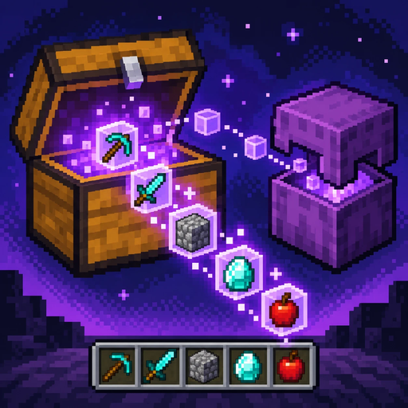

# StashLink

Mod de qualidade de vida para Minecraft — **Fabric** e **NeoForge**.

- Use itens de **shulker boxes** direto do inventário, sem colocá-las no chão.
- Shulkers/baús colocados perto (raio configurável) também servem de fonte.
- Integração com **Litematica**: construa clicando na pré-visualização com os materiais na shulker.
- **N** guarda seus itens em baús próximos que já tenham aquele item.
- **W** dentro de um baú puxa tudo o que couber no inventário.
- **Alt + clique** num slot de baú o reserva para aquele item: só ele entra, **N** prefere esse slot e o slot vazio mostra uma prévia (só com o mod no servidor e no cliente; vale em baú duplo, barril e shulker colocada).
- Cada função tem **liga/desliga e um cadeado** na tela de config (tecla **K**), como o seletor de dificuldade do jogo: o botão é seu; o cadeado, do dono do servidor ou de um operador, impede a função de funcionar naquele servidor (ou `/stashlink feature <nome> lock|unlock`).

## Dois modos de funcionar

- **Servidor com o StashLink** (mundo local, ou servidor com o mod): o servidor faz o trabalho. Raio configurável
  (até 64 blocos), usa shulkers e baús próximos, e tudo é validado no servidor.
- **Modo cliente** (servidor **sem** o mod, como um Realms): o mod funciona só no seu cliente, agindo como um
  jogador. Ele abre o container, move os itens por cliques de inventário e fecha — o mesmo que você faria à mão,
  só que automático. Liga/desliga em "Modo cliente" na tela de configuração (padrão: ligado). Cobre **W**
  (puxar tudo) e **N** (guardar em containers que já têm o item). Também reabastece a mão: quando o
  último item acaba, abre containers/shulkers colocados perto (os mais prováveis primeiro), traz o mesmo item para a
  mão e fecha. Shulker no inventário fica fora: o cliente não vê o conteúdo dela.

Limites do modo cliente:
- O alcance é o de interação do jogo (~4,5 blocos), não o raio do servidor.
- O mod só conhece o conteúdo de um container depois de abri-lo.
- Não reabastece a partir de shulker que está no **inventário** (isso só com o mod no servidor).
- As proteções/claims do servidor valem sozinhas: se o servidor não deixa abrir o container, o mod não abre.
- Os containers abrem e fecham de forma visível enquanto o mod trabalha.

Status: versão 1.0 em preparação. Veja [CHANGELOG.md](CHANGELOG.md), [docs/ROADMAP.md](docs/ROADMAP.md) e [docs/ARCHITECTURE.md](docs/ARCHITECTURE.md).

## Instalar

Baixe o jar do seu loader (Fabric ou NeoForge) na página de Releases e coloque na pasta `mods`. Litematica é opcional (só Fabric).

## Testes

`./gradlew build` (testes unitários) e `./gradlew :fabric:runGameTest` (servidor real com jogadores simulados).
